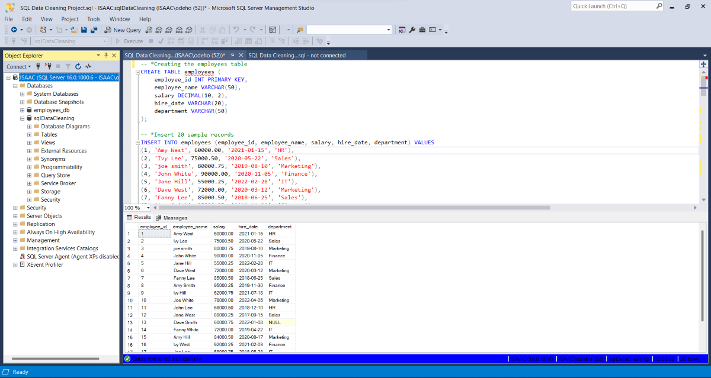
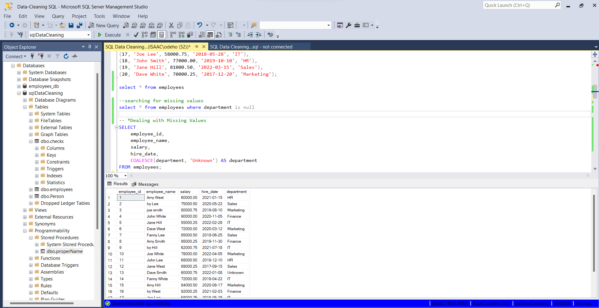
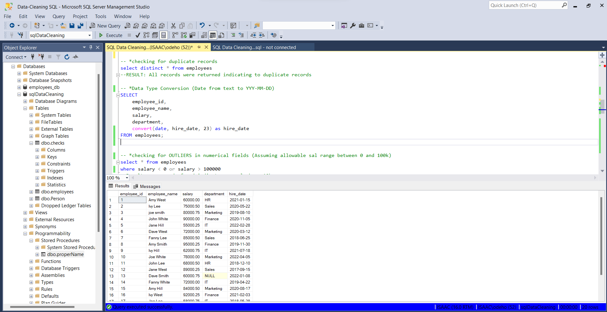
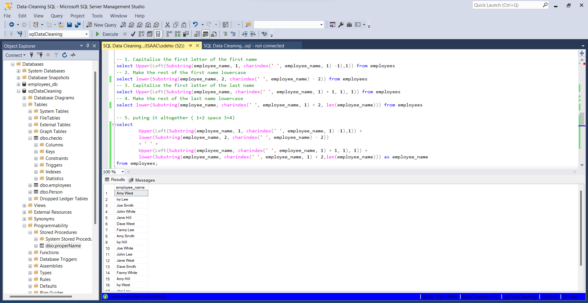

# Data Cleaning In SQL

## Introduction

The goal of this data cleaning project was to enhance the quality and consistency of the data in the 'employees' table using Microsoft SQL Server. The dataset contains information about employees, including their names, salaries, hire dates, and departments. The cleaning process addressed missing values, duplicate records, data type conversion, handling outliers, and ensuring consistent data entry.

**Common data issues that require cleaning:**

- Missing Data: Missing values in a dataset can lead to inaccurate calculations or incomplete analysis.
- Duplicate Data: Duplicate records can cause overestimation or underestimation of certain metrics and affect the overall data quality.
- Inconsistent Data: Inconsistent data formats, units, or representations can create confusion and hinder data analysis.
- Invalid Data: Data that does not adhere to predefined rules or constraints is considered invalid and can cause errors or misleading results.

----
## Data Cleaning Requirments in this project
1. Dealing with Missing Values
2. Checking for Duplicate Records
3. Data Type Conversion (Date from text to YYYY-MM-DD)
4. Checking for Outliers in Numerical Fields
5. Checking for Inconsistent Data Entry (Case Type) in String Fields
6. Data Transformation (Adding New Fields)
   
## Data Sourcing
The fictional data was created within Microsoft SQL server using the CREATE TABLE Syntax and twenty (20) Records of data where inserted as detailed below

 EMPLOYEES TABLE with five (5) FIELDS namely
1. EMPLOYEE_ID, data type INT
2. EMPLOYEE_NAME, data type VARCHAR
3. SALARY, data type DECIMAL
4. HIRE_DATE, data type VARCHAR
5. DEPARTMENT, data type VARCHAR
----
## Data Transformation/Cleaning:
1. Dealing with Missing Values
Missing values in the 'department' column were handled by using the COALESCE function to replace them with 'Unknown'. This ensures that all records have a valid department designation.

`SELECT
	employee_id,
	employee_name,
	salary,
	hire_date,
	COALESCE(department, 'Unknown') AS department
FROM employees;`

2. Checking for Duplicate Records
Duplicate records were identified using the DISTINCT keyword, indicating that there are indeed duplicate entries in the dataset. Further investigation and actions, such as removing or consolidating duplicates, are recommended based on the specific use case.

`SELECT DISTINCT * FROM employees;`

4. Data Type Conversion (Date from text to YYYY-MM-DD)
The 'hire_date' column was converted from a text format to the standard date format (YYYY-MM-DD) using the CONVERT function.

`SELECT
	employee_id,
	employee_name,
	salary,
	department,
	CONVERT(DATE, hire_date, 23) AS hire_date
FROM employees;`

4. Checking for Outliers in Numerical Fields
An assumption was made that the salary range should be between 0 and 100,000. A query was executed to identify any salaries outside this range. No records were found, indicating that the salaries in the dataset are within the expected range.

`SELECT * FROM employees
WHERE salary < 0 OR salary > 100000;`

Result: no records found indicates no sal above 10k

5. Checking for Inconsistent Data Entry (Case Type) in String Fields
Queries were employed to standardize the case of names by capitalizing the first letter of the first and last names while making the rest lowercase.

*The quiries to achieve this can prove confusing for some, hence it will be broken down to aid clarity

- Capitalize the first letter of the first name

  `select Upper(Left(Substring(employee_name, 1, charindex(' ', employee_name, 1) -1),1)) from employees`
- Make the rest of the first name lowercase

  `select lower(Substring(employee_name, 2, charindex(' ', employee_name) - 2)) from employees`
- Capitalize the first letter of the last name

  `select Upper(Left(Substring(employee_name, charindex(' ', employee_name, 1) + 1, 1), 1)) from employees`
- Make the rest of the last name lowercase

  `select lower(Substring(employee_name, charindex(' ', employee_name, 1) + 2, len(employee_name))) from employees`
- puting it altogether ( 1+2 space 3+4)

  `select	
		Upper(Left(Substring(employee_name, 1, charindex(' ', employee_name, 1) -1),1)) + 
		lower(Substring(employee_name, 2, charindex(' ', employee_name) - 2))
		+ ' ' +
		Upper(Left(Substring(employee_name, charindex(' ', employee_name, 1) + 1, 1), 1)) + 
		lower(Substring(employee_name, charindex(' ', employee_name, 1) + 2,len(employee_name))) as employee_name 
from employees;`

6. Data Transformation (Adding New Fields)
A new field 'LOS' (Length of Service) was added to calculate the years of service by subtracting the 'hire_date' from the current date.

`SELECT 
	employee_id, 
	employee_name,
	salary,
	hire_date,
	department,
	DATEDIFF(YEAR, hire_date, GETDATE()) AS 'LOS' 
FROM employees;`

## DATA MODELLING
Power BI automatically connected related tables resulting in a star schema model.
The 'Order' table is the fact table of the model.
The remaining two dimension tables; 'Return' table and 'People' table are connected to the 'Order' table via the common columns: 'order ID' and Region respectively.

## Data Analysis and Visuals

1. From the dashboard, it is observed that it takes 4 days on average to deliver each product on every order.
2. Total sales made in 2012= 2.26M, 2013=2.68M ,2014=3.41M ,2015=4.30M.
3. Sales is highest in the Western Europe region with almost 450k dollars.

 Tamara Chand is the most valuable costumer by sales.
 
 ## conclusions & Recommendations
- An order takes 4days on average before delivery.
- There has been a gradual increase in the yearly sales since 2012 at the rate of approximately 19%.
- Different customers topped the profit list for each year.
- **Tamara Chand** has made the highest sales overall since 2012 to 2015. 
 However, on a yearly basis,
**Sanjit Chand** made the highest sale in 2012 with over 5.7k dollars while Tamara Chand could not make the top 10 sales for that year. 

In 2013;
 **Mike Gokenbach** made the higest sales with 4.8k dollars.

In 2014;
**Tamara chand** purchased products worth 8.5k.

In 2015;
**Raymond Buch** purchsed products worth $7.4k.

- **Canon Image (Class 2200) advance copier** made the highest profit in both 2014 and 2015.
Other Insights:
- The consumer segment has made more than 50% of the total sales. 
- Asia Pacific is the region with the highest sales.

